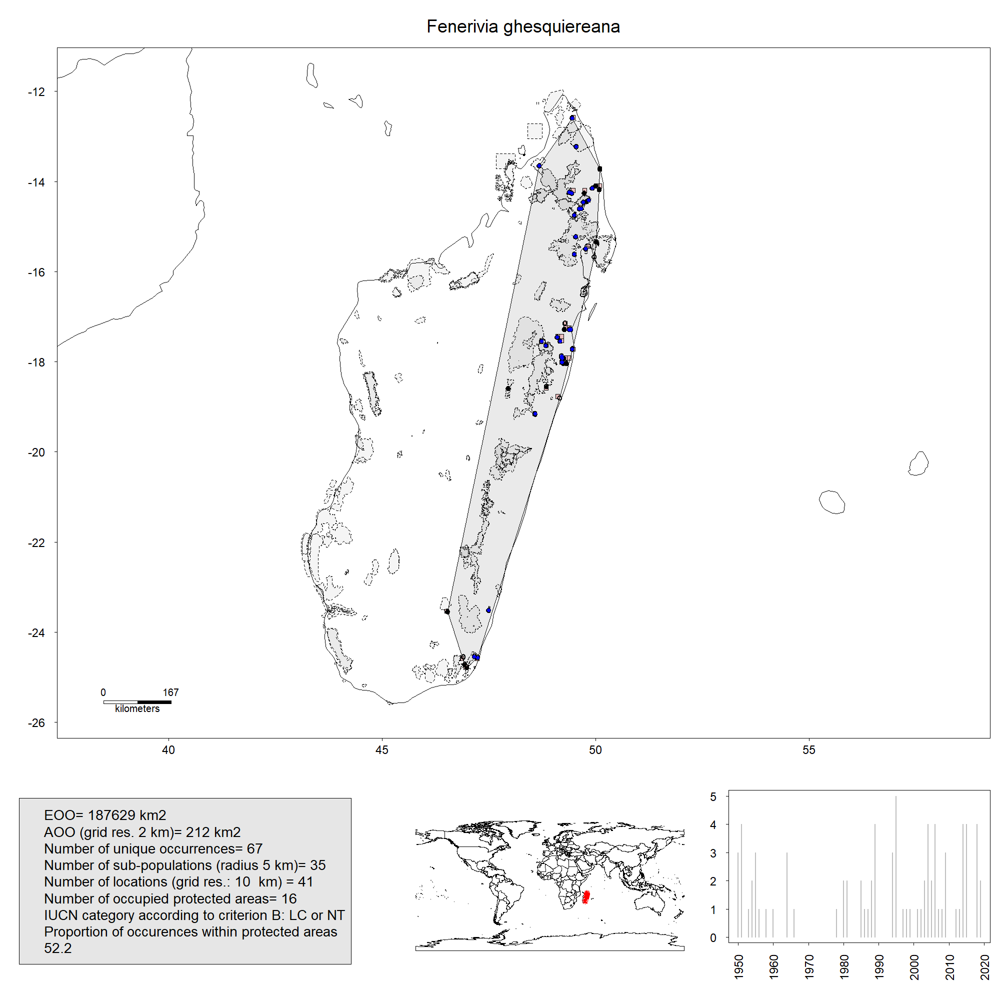
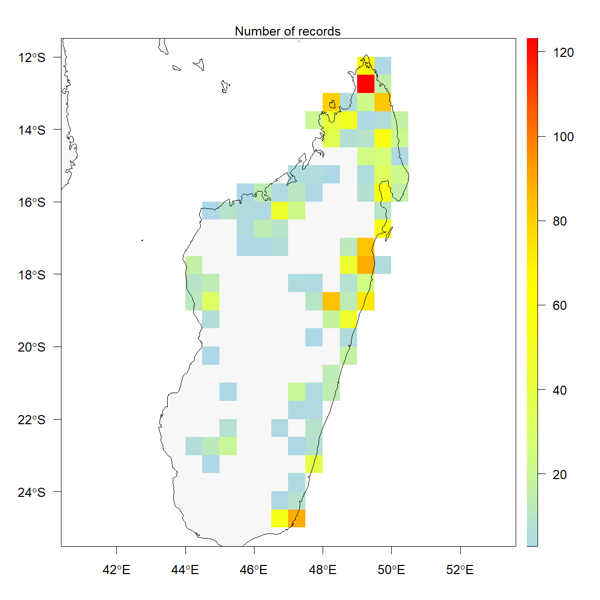
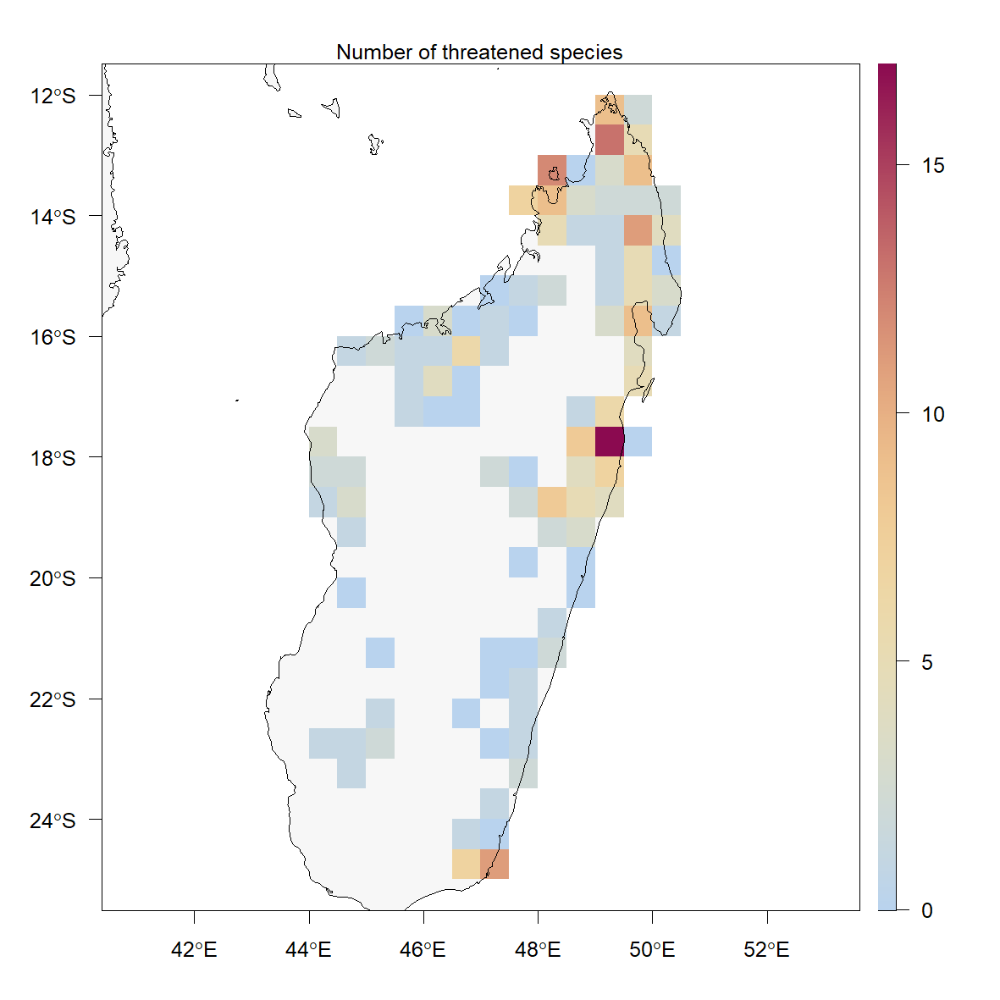
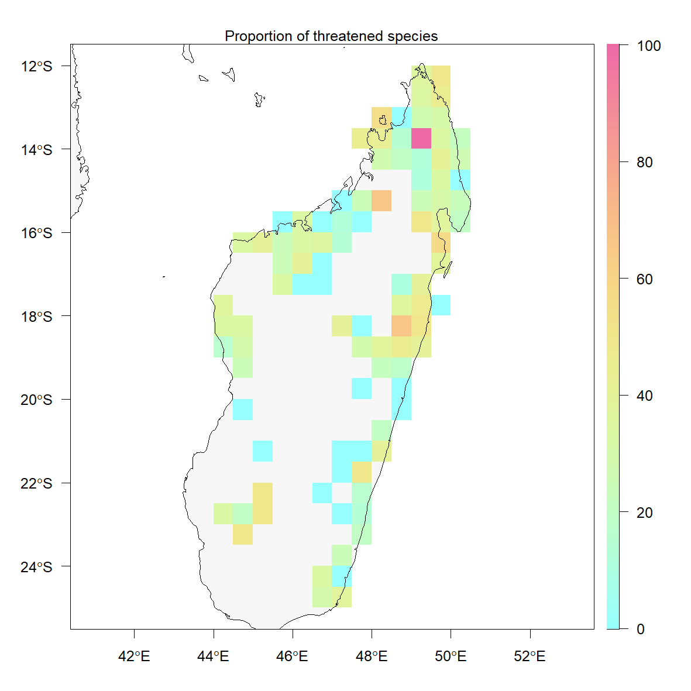
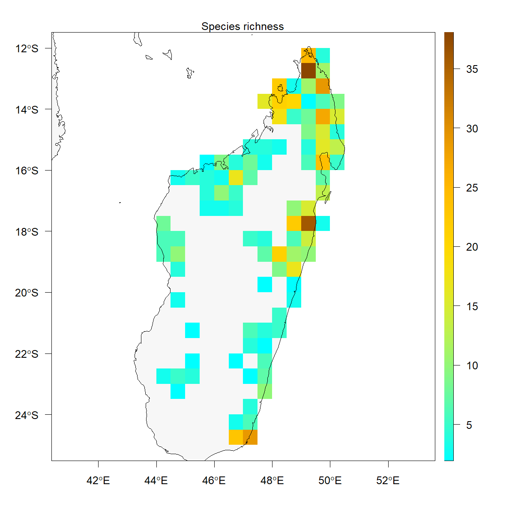

```{r setup, include=FALSE}
knitr::opts_chunk$set(echo = TRUE)
```

# Initial things to do

## Set working directory

This is your own working directory, on your PC, update path below

```
setwd("C:/Users/couvreur/Documents/R/mada_annon_R/")
```

## Load needed libraries

**optional**: Install them first if not done already  

```
install.packages(c("ConR", "devtools", "mapproj", "maps", "rnaturalearthdata",
                   "rgbif", "raster", "rnaturalearth", "tidyverse", "maptools"))
```

Load the libraries

```
library(rworldmap)
library(ConR)
library(maptools)
```

```{r include = FALSE}
library(rworldmap)
library(ConR)
library(maptools)
```


# Import original raw occurence dataset


Update paths and file name to your own

```{r}
df <- read.csv("data/occs_cleaned_medrged_WAG_TAN_MO_P_03092021.csv", header = TRUE, sep = ";", stringsAsFactors = FALSE)
```

You should have a dataframe now.  


# Plot country map with raw occurences

## Import free maps "rworldmap"

```{r}
newmap <- getMap(resolution = "low")
```

## Plot world map and raw occurences

Here, focusing on Madagascar (but you can update coordonates under xlim and ylim)   
Points can be changed via *pch* option  

```{r newmap, fig.cap="Raw distribution of Annonaceae", echo=TRUE, message=FALSE, warning=FALSE, error=FALSE}
plot(newmap, xlim = c(40, 50), ylim = c(-27, -12), asp = 1, axes=TRUE)
points(as.numeric(df$ddlong), as.numeric(df$ddlat), col = "red", cex = 1, pch = 19)
```

# Filter raw dataset for `ConR` analysis

Here, we shall filter the dataset, and prepare a dataframe for `ConR`: we will end up with the dataframe *df_mada_conR*  

1) delete all records not in Madagascar  
2) use only records that are identified to species level  
3) Keep and order columns we need for `ConR` (*ddlat*, *ddlong*, *tax*, (optional: collection year; *coly*))  

## Filter country, keep only *Madagascar*

we use the function *subset()*  

```{r}
df_mada = subset(df, country == "Madagascar")
```

## Keep only records identified to species level

We will extract non-blank rows for *specific_epithet*, using *==""*

```{r}
df_mada_sp = df_mada[!(df_mada$specific_epithet==""), ]
```


## Remane *ColYear* to *coly*

ColYear is the 13th column of the dataframe in our database, need to update if different

```{r}
colnames(df_mada_sp)[13] <- "coly"
```

## Select rows we need for `ConR`

These are, **in this order**: *ddlat*, *ddlong*, *tax* and (optional) *coly*  
We do not have a *tax* column, so we shall create it: *genus* + *specific_epithet*  

### Create a new "tax" column by merging (paste) genus and specific_epithet columns

```{r}
df_mada_sp$tax = paste(df_mada_sp$genus, df_mada_sp$specific_epithet)
```

### Extract and reorganize columns


1) without collection year column *coly*

```{r}
df_mada_conR = df_mada_sp[c("ddlat","ddlong","tax")]
```

2) with collection year column *coly*

```{r}
df_mada_conR = df_mada_sp[c("ddlat","ddlong","tax","coly")]
```


Now we have the final dataframe *df_mada_conR*  for `ConR` analysis.

# Running a simple `ConR`

A simple IUCN evaluation without protected areas (PAs)

```
IUCN.eval(df_mada_conR)
```

The function creates an excel file *IUCN_results.xlsx* located in in your working directory  

# Running a full `ConR` with protected areas and collection dates

## Importing protected area (PAs) shapefiles

First we need to import the PA shape file  
`ConR` has one for Madagascar only, which we can use, or use a new one downloaded from [protectedplanet](https://www.protectedplanet.net/)

### Import your own shapefile & plot country with protected areas

The shapefile must be in your dierctory already  
CAREFULL: Include **all** extensions: *.dbf*, *.shp*, *.shx*) in the same folder  

```{r echo=FALSE, message=FALSE, warning=FALSE, error=FALSE}
mada_shape = readShapePoly("data/mada_protected.shp", proj4string=CRS ("+proj=longlat +datum=WGS84"))
```

```{r fig.cap = "Madagascar with protected areas", echo=TRUE, message=FALSE, warning=FALSE, error=FALSE}
plot(newmap, xlim = c(40, 50), ylim = c(-27, -12), asp = 1, axes=TRUE)
plot(mada_shape, col="green", lwd=0.25, add=TRUE)
```

### Import the PA shapefile availible in `ConR` (has less PAs)

```{r}
data(Madagascar.protec)
```

```{r fig.cap = "Madagascar with protected areas from ConR",echo=TRUE, message=FALSE, warning=FALSE, error=FALSE}
plot(newmap, xlim = c(40, 50), ylim = c(-27, -12), asp = 1, axes=TRUE)
plot(Madagascar.protec, col="green", lwd=0.25, add=TRUE)
```

# Run a full `IUCN.eval` taking into account PAs

Here we shall first undertake the iucn analysis and then map the results.

> Optional: check col name of the shapefile

```
colnames(mada_shape@data)
```

## Run `IUCN.eval`

ID_shape_PA = "WDPA_PID": unique id of each protected area  
Depending on the number of species, this can take a few minutes  
The function creates an excel file *IUCN_results.xlsx* located in your working directory  
Also creates a file with all the maps *IUCN_results_map*. You can turn that off with `DrawMaps=FALSE` (having the DrawMaps function on takes longer)

```{r echo=TRUE, message=FALSE, warning=FALSE, error=FALSE, results = "hide"}
MyResults <- IUCN.eval(df_mada_conR, protec.areas = mada_shape, ID_shape_PA = "WDPA_PID", showWarnings = FALSE, DrawMap = TRUE)
```

## Exemple map for a single species



# Map results with `map.res`

**Details of options map.res**:  
- The argument *Occurrences* should include the input file.
- The argument *country_map* should include the background spatial polygon. In this case, we use the default land shapefile that should be loaded once before using *data()*.  
- The argument *export_map* is logical. If TRUE, maps are exported in your working environment.  
- The argument *Resol* must be numerical. It indicates the resolution of the grid cell.  
- The argument *threshold* must be numerical. It indicates the minimum number of occurrences within each grid cell: above, it is defined as 3. Hence, only grid cells with at least three occurrences are shown.  
- The arguments *LatMin*, *LatMax*, *LongMin* and *LongMax* are minimum/maximum latitude/longitude of the maps. If not given, the extent of the map is the extent of all occurrences.  

## Import the "land" layer (world map available in `ConR` open access)  

```{r}
data(land)
```

## Run `map.res`

This will create four spatial maps, saved in your working directory *IUCN_results_map*, same as all the species maps  

We can zoom into the country area we want using the coordinate limits  

```{r echo=TRUE, message=FALSE, warning=FALSE, error=FALSE}
map.res(MyResults, Occurrences=df_mada_conR, country_map=land, export_map=TRUE, threshold=3, LatMin=-25,LatMax=-12,LongMin=42, LongMax=52, Resol=0.5)
```

## Map of diversity and conservation








