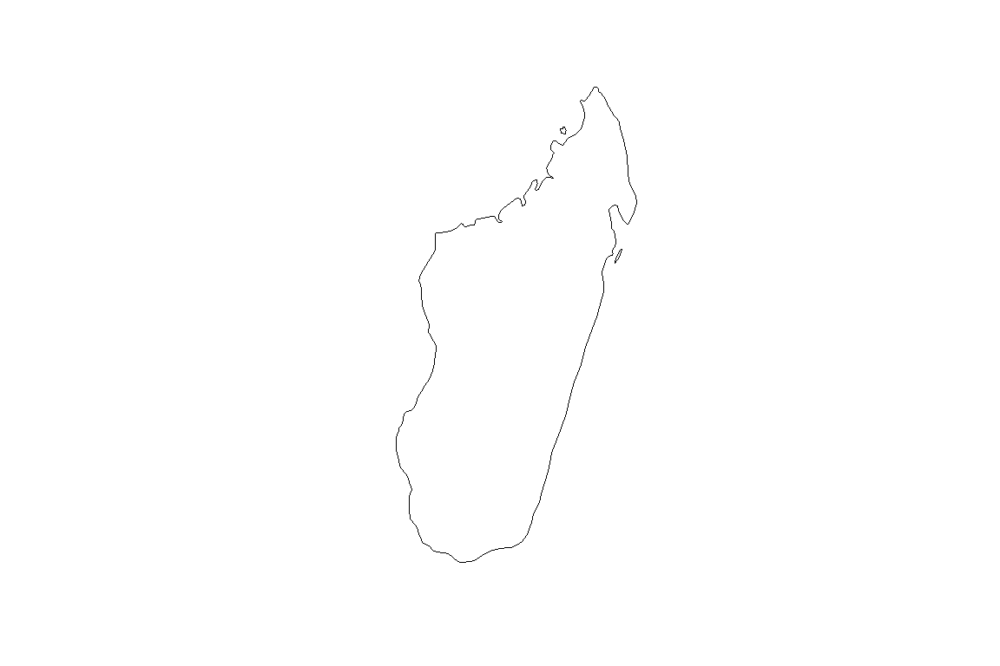
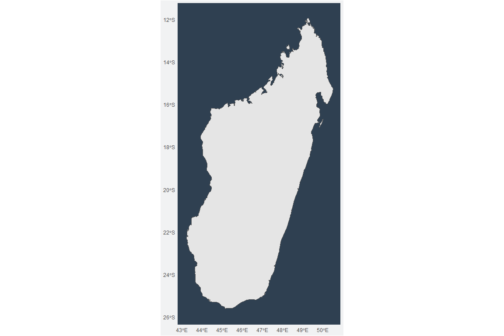
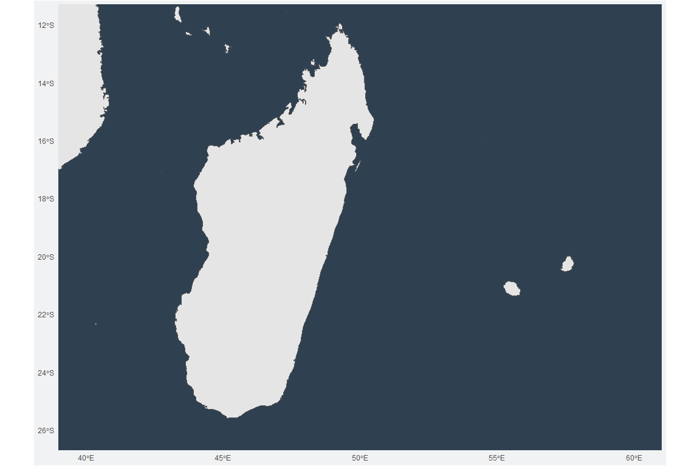
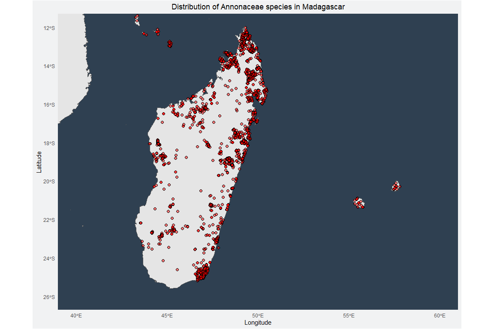

> Here we shall learn how to:  
- import and plot different type of maps, either at country or regional levels  
- import distribution data and plot them onto the maps  

# Initial things to do

## Set working directory

This is your own working directory, on your PC, update path below

```
setwd("C:/Users/couvreur/Documents/R/mada_annon_R/")
```

## Load needed libraries

**optional**: Install them first if not done already  

```
install.packages(c("ConR", "devtools", "mapproj", "maps", "rnaturalearthdata",
                   "rgbif", "raster", "rnaturalearth", "tidyverse", "maptools", "ggmap"))
```
Load the libraries

```
library(ggmap)
library(ggplot2)
library(sf)
library(dplyr)
library(ggplot2)
library(scico)
library(rnaturalearth)
library(purrr)
library(smoothr)
library(rworldxtra)
```


# Plot country or regional maps

Select what country you want here:


```r
country = "Madagascar"
```

Or select the region you want, using coordinates:


```r
xlat = c(40, 60)
ylong = c(-26, -12)
```

We can plot maps at two levels of precision in terms of countries: Low and high.  
Maps are plotted using `ggplot2`, see after.  

## Low precision maps

1) Import a lower definition map from `rnaturalearth` package


```r
worldMap <- ne_countries(scale = "medium", type = "countries", returnclass = "sf")
```

2) Filter the country you want, creates a *NCpoly_low* object


```r
CNpoly_low <- worldMap %>% filter(sovereignt == country)
```

3) Simple plot of the map using *plot()* function

```r
plot(CNpoly_low$geometry)
```

<!-- -->

## High presicion maps

1) Import a higher definition map from `rworldxtra` package

This is part of the package. We need to transform it to a `sp` format after using *st_as_sp* function. This procudes a *CNhigh* object


```r
data(countriesHigh)
CNhigh = st_as_sf(countriesHigh)
```

2) Filter the country you want, creates a *NCpoly* object


```r
CNpoly <- CNhigh %>% filter(ADMIN == country)
```

## Plot *country* map with `ggplot2`

Plot the high definition country filtered above.

Set limits around country, creates a *limsCN* object


```r
limsCN <- st_buffer(CNpoly, dist = 0.7) %>% st_bbox
```

Plot map with different options that can be changed. 


```r
divpolPlot <-
  ggplot() +
  geom_sf(data = CNpoly) +
  coord_sf(
    xlim = c(limsCN["xmin"], limsCN["xmax"]),
    ylim = c(limsCN["ymin"], limsCN["ymax"])
  ) +
  theme(
    plot.background = element_rect(fill = "#f1f2f3"),
    panel.background = element_rect(fill = "#2F4051"),
    panel.grid = element_blank(),
    line = element_blank(),
    rect = element_blank()
  )
divpolPlot
```

<!-- -->

## Plot *regional* map with `ggplot2`

Here we shall indicate a region using coordinates, rather than filtering for a country.  
We use the *CNhigh* object.  
Here coordinates for Madagascar. CAREFULL: *xlat* and *ylong* are defined above.


```r
divpolPlot <-
  ggplot() +
  geom_sf(data = CNhigh) +
  coord_sf(
    xlim = xlat,
    ylim = ylong
  ) +
  theme(
    plot.background = element_rect(fill = "#f1f2f3"),
    panel.background = element_rect(fill = "#2F4051"),
    panel.grid = element_blank(),
    line = element_blank(),
    rect = element_blank()
  )
divpolPlot
```

<!-- -->

# Plot species distribution data on map

## Import original raw occurence dataset

Update paths and file name to your own


```r
df <- read.csv("data/occs_cleaned_medrged_WAG_TAN_MO_P_03092021.csv", header = TRUE, sep = ";", stringsAsFactors = FALSE)
```

Our raw database contains **2927** unique records representing **17** genera and **110** species.

## Plot distribution data on *regional* map

We have now added a *geom_point* argument to the ggplot script:  

`geom_point(data=df, aes(x=ddlong, y=ddlat), bg = rgb(red = 1, green = 0, blue = 0, alpha = 0.5), col = "black", pch = 21, cex=2) +`

Color and shape of points can be changed in the script.
In our file, the columns *ddlat* and *ddlong* indicate the coordinates.  


```r
divpolPlot <-
  ggplot() +
  geom_sf(data = CNhigh) +
  geom_point(data=df, aes(x=ddlong, y=ddlat), bg = rgb(red = 1, green = 0, blue = 0, alpha = 0.5), col = "black", pch = 21, cex=2) +
  coord_sf(
    xlim = xlat,
    ylim = ylong
  ) +
  theme(
    plot.background = element_rect(fill = "#f1f2f3"),
    panel.background = element_rect(fill = "#2F4051"),
    panel.grid = element_blank(),
    line = element_blank(),
    rect = element_blank()
  )
divpolPlot + ggtitle("Distribution of Annonaceae species in Madagascar") + theme(plot.title = element_text(hjust = 0.5)) + xlab("Longitude") + ylab("Latitude")
```

<!-- -->


