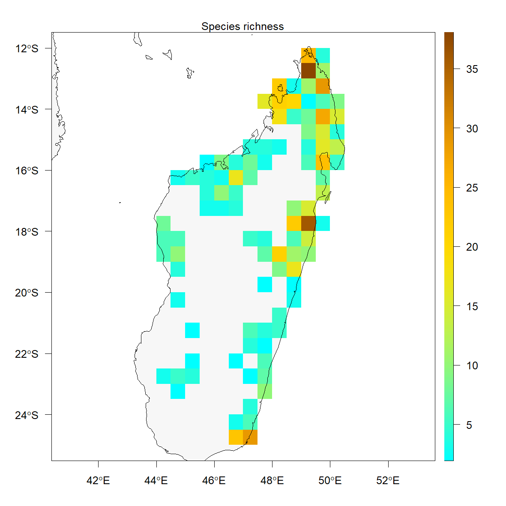

# Annonaceae conservation status in Madagascar

R script to analyze conservation status of Annonaceae in Madagascar using the [ConR package](https://github.com/gdauby/ConR)

This dataset was complied using data from P, MO, TAM and WAG herbaria.

